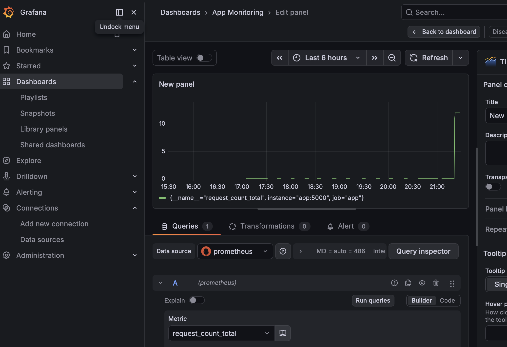

# Docker Monitoring Demo

A containerized monitoring system using Docker, Prometheus, and Grafana to collect and visualize application metrics.

## Tech Stack

- Docker
- Docker Compose
- Python (Flask)
- Prometheus
- Grafana

## Services

- App — Flask application with Prometheus metrics
- Prometheus — collects and stores metrics
- Grafana — visualizes metrics

## Run locally

docker compose up --build

## Endpoints

- App: http://localhost:5002
- Prometheus: http://localhost:9090
- Grafana: http://localhost:3000

## Notes

This project is intended for learning DevOps fundamentals including containerization and monitoring.

## Dashboard

